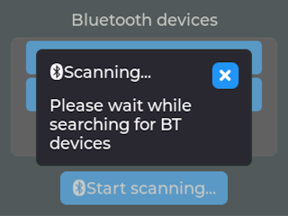
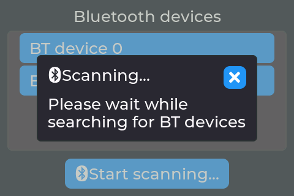
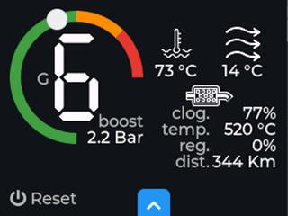
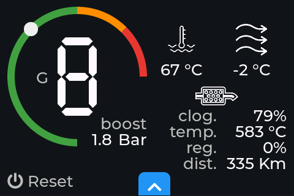
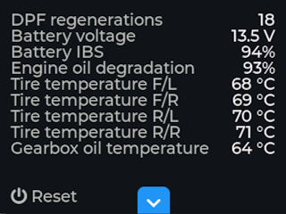
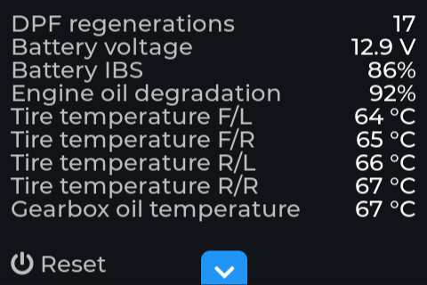

# Giulia TFT

Display Giulia and Stelvio JTDm additional data and monitor DPF regenerations using ESP32, LCD touchscreen display and Bluetooth OBD2 adapter.

I'm using ELECROW ESP32 display-3.5 Inch HMI Display 320x480 SPI TFT LCD Touch Screen (ILI9488, SKU DIS05035H) and ScanTool OBDlink LX 427201; I'm not providing links in this README as I am not affiliated to any of the companies I'm mentioning here.

## Features

Main screen:

- Absolute boost pressure (Bar)
- Current gear
- Coolant temperature (°C)
- Intake air temperature after the intercooler (°C)
- DPF clogging (%) 
- DPF temperature (°C) 
- DPF regeneration process (%) 
- Distance from the latest DPF regeneration (Km) 

Secondary screen:

- Total DPF regenerations
- Battery voltage (V) 
- Battery IBS (%)
- Engine oil degradation (%)
- Tires temperatures (°C)
- Gearbox oil temperature (°C)

On first boot a touch screen calibration display wizard will start and calibration data will be persisted. On the devices screen, after scanning, you can pick an adapter to connect to.

If you have a buzzer connected you will get a 5 beeps warning when DPF regeneration process starts.

## Screenshots on 3.5'' and 2.8'' TFT displays (values are random):

| Screen                        |                                             2.8''                                             |                                             3.5''                                             |
| :---------------------------- | :-------------------------------------------------------------------------------------------: | :-------------------------------------------------------------------------------------------: |
| Connection                    |                                        |                                        |
| Main                          |                                                    |                                                    |
| Main (while regenerating DPF) | ") | ") |
| Secondary                     |                                          |                                          |

To switch between the 2 data screens use the button on the bottom/center. To reset the device use the button on the bottom/left; soft reset will just reboot while hard reset will remove calibaration and default device settings.

Giulia TFT automatically handles reboot or deepsleeps when the Bluetooth connection is not working properly or the engine has been switched off.

# Building

You can compile it using [Visual Studio Code](https://code.visualstudio.com/) with [PlatformIO plugin](https://platformio.org/install/ide?install=vscode); the project provides builds for:

- `env:denky32` will build the ESP32 firmware with custom partition table (OTA ready)
- `env:emulator_35_64bits` and `env:emulator_28_64bits` will build the emulator image so you can develop the UI without flashing it to the physical device

Emulator must be properly setup as described in the [Run LittlevGL via PlatformIO](https://github.com/lvgl/lv_platformio/blob/master/README.md) README as it depends on the OS.

Relevant `build_flags`:

- `GT_SPLASH_MESSAGE`: default is "Giulia TFT" but maybe you own a Stelvio :smile:
- `LV_FONT_*` and `GT_FONT_*`: fonts for 3.5'' and 2.8'' displays are provided; check emulators flags if you need to build for 2.8 TFT
- `GT_DEMO`: this build won't try to connect to any devices and some random demo values will be displayed
- `GT_VERBOSE_LOG`: enable verbose serial logging
- `SPI_FREQUENCY`: display refresh frequency; the TFT I'm using for this project is serial and it' pretty slow but good enough
- `ELM_DEBUG`: enable VERY verbose ELM protocol logs
- `GT_BUZZER_PIN`: buzzer connection GPIO

# Right-Hand Drive models

In [consts.h](includes/consts.h) I do `#define GT_ROTATION 3` because the TFT display is meant to be used in portrait mode and this rotation setting gives good visibility in landscape mode as I keep the device under AC controls using a smartphone holder; if you're driving a right-hand drive model you might wanna change this to `1`.

# License

This software is licensed under [GPLv3](LICENSE); it's based on these libraries/resources:

Fonts:

- [7segments font](https://fontstruct.com/fontstructions/show/1775612) licensed [SIL OPEN FONT LICENSE Version 1.1](https://fontstruct.com/fontstructions/license/1775612/7segments-2)
- [DPF icon](https://commons.wikimedia.org/wiki/File:Kontrollleuchte_DPF.svg) licensed [CC0 1.0 Universal Public Domain Dedication](https://creativecommons.org/publicdomain/zero/1.0/legalcode.en)
- [Coolant](https://thenounproject.com/icon/coolant-4372128/) and [vent icons](https://thenounproject.com/icon/vent-1747453/) from Car dashboard outline by LAFS collections licensed [Creative Commons CC BY 3.0](https://creativecommons.org/licenses/by/3.0/legalcode.en)

Libraries:

- [TFT_eSPI](https://github.com/Bodmer/TFT_eSPI) licensed [MIT](https://github.com/Bodmer/TFT_eSPI/blob/master/license.txt)
- [ELMDuino](https://github.com/PowerBroker2/ELMduino) licensed [MIT](https://github.com/PowerBroker2/ELMduino/blob/master/LICENSE.md)
- [ESP32-Buzzer](https://github.com/hammikb/ESP32-Buzzer) licensed [MIT](https://github.com/hammikb/ESP32-Buzzer/blob/main/LICENSE)
- [LVGL](https://github.com/lvgl/lvgl) licensed [MIT](https://github.com/lvgl/lvgl/blob/master/LICENCE.txt)
- [TFT_eWidget](https://github.com/Bodmer/TFT_eWidget) licensed [0BSD](https://github.com/Bodmer/TFT_eWidget/blob/main/license.txt)
- [log4arduino](https://github.com/jandelgado/log4arduino) licensed [MIT](https://github.com/jandelgado/log4arduino/blob/master/LICENSE)
- [lv_drivers](https://github.com/lvgl/lv_drivers) emulator only - licensed [MIT](https://github.com/lvgl/lv_drivers/blob/master/LICENSE)

# Support

This a project-for-fun; feel free to fork, build, experiment but having a full time job I won't be able to give any support to this. Also I'm not a C/C++ developer and you might get it from the code quality :smile: